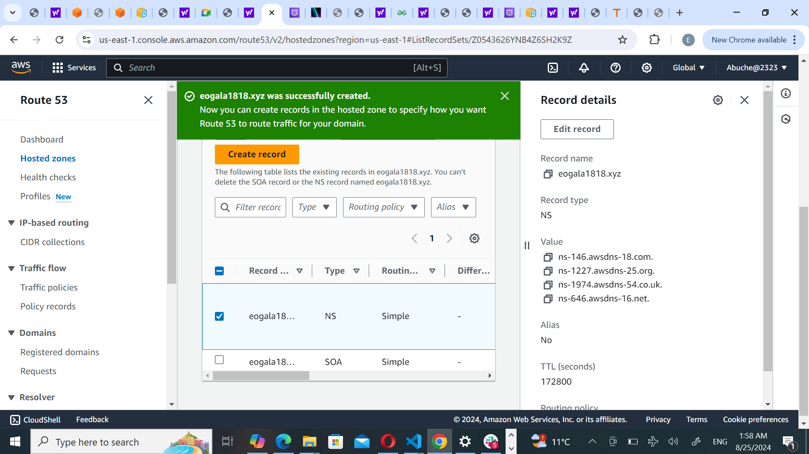
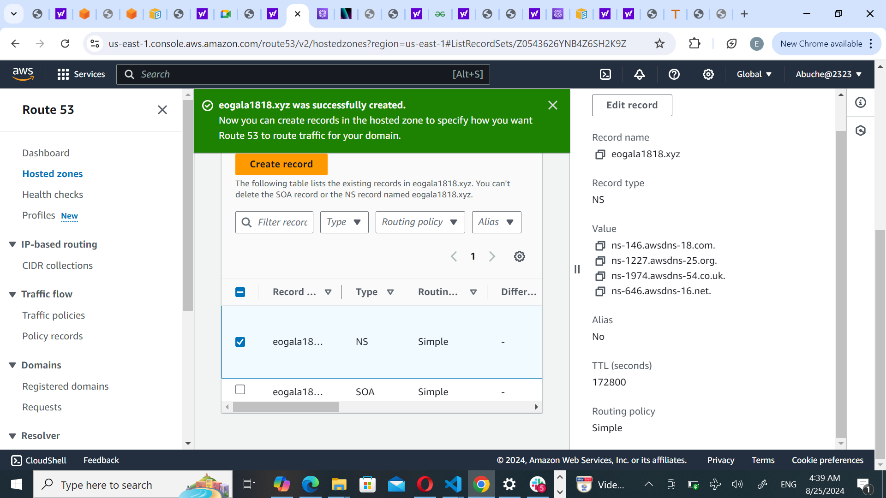
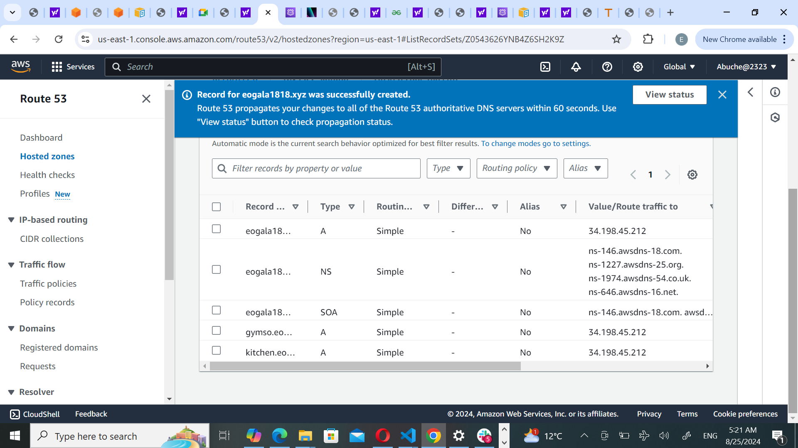
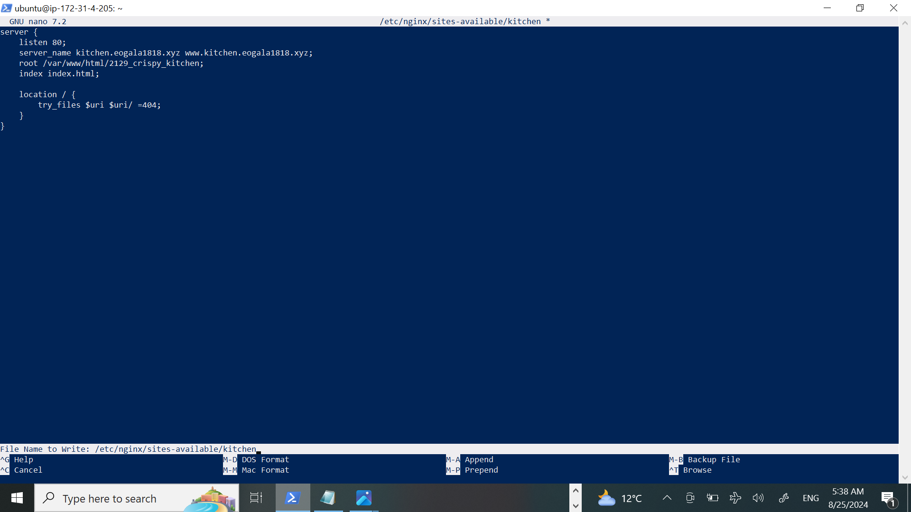
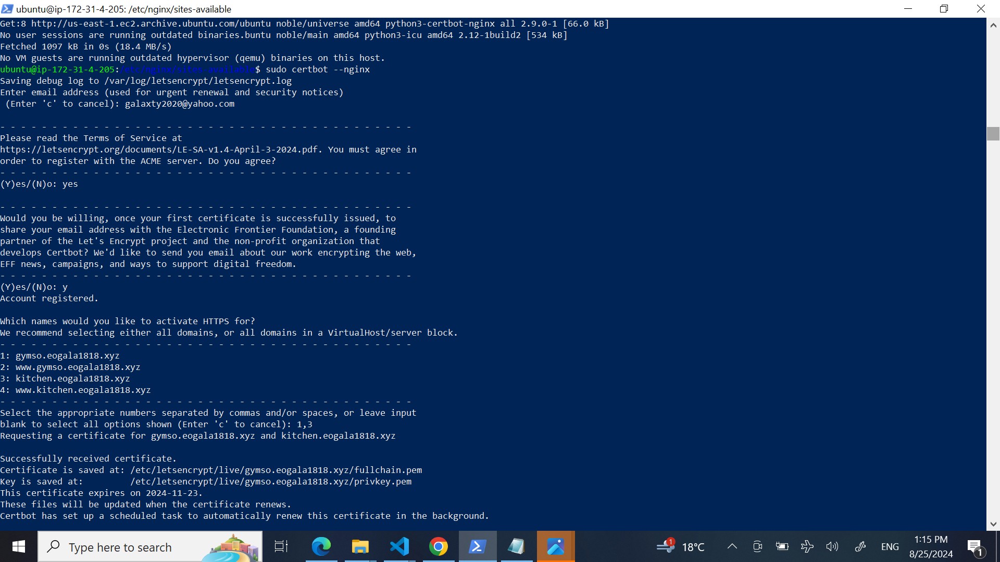
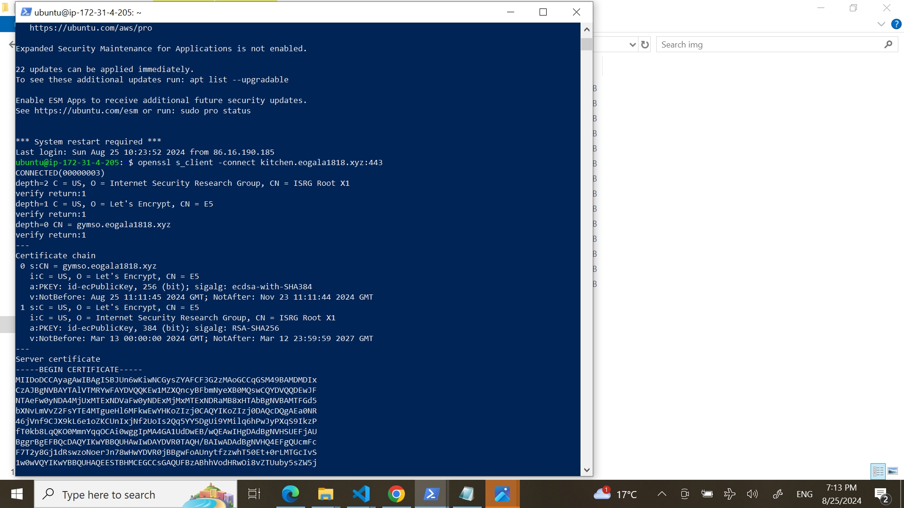

# Setting up Multiple Static Websites on a Single Server Using Nginx Virtual Hosts

 This project involves subdomains and hosting multiple websites on a single server using Nginx Virtual Host configuration.
 
## S/N	Project Tasks
* Install and configure Nignx on a server
* Create two website directories with two different website templates.
* Create two subdomains
* Add the IP of the server as A record to the two subdomains.
* Configure the Virtual host to point two subdomains to two different website directories.
* Validate the setup by accessing the subdomains.
* Create a certbot SSL certificate for the root Domain.
* Configure certbot on Nginx for two websites.
* Validate the subdomain websites’ SSL using OpenSSL utility.

# Documentation
Ubuntu server was spinned up, elastic IP is been associate to my instance.   Note: taking refrence from Project1
## Install Nginx and Setup Website
*Execute the following commands.
- sudo apt update
- sudo apt upgrade
- sudo apt install nginx
*Start your Nginx server by running the sudo systemctl start nginx command, enable it to start on boot by executing sudo systemctl enable nginx, and then confirm if it's running with the sudo systemctl status nginx command.
*Visit your instances IP address in a web browser to view the default Nginx startup page.

.png)

* Template Downloaded from https://www.tooplate.com
* Right clicked and selected Inspect from the drop down menu
* Right clicked on the website name, select Copy and click on Copy link address for 1 and 2 website template

.png)

.png)

To install the unzip tool, the following command was used: sudo apt install unzip.
Execute the command to download and unzip your website files.sudo curl -o /var/www/html/2129_crispy_kitchen.zip https://www.tooplate.com/zip-templates/2129_crispy_kitchen.zip && sudo unzip -d /var/www/html/ /var/www/html/2129_crispy_kitchen.zip && sudo rm -f /var/www/html/2129_crispy_kitchen.zip.

sudo curl -o /var/www/html/2119_gymso_fitness.zip https://www.tooplate.com/zip-templates/2119_gymso_fitness.zip && sudo unzip -d /var/www/html/ /var/www/html/2119_gymso_fitness.zip && sudo rm -f /var/www/html/2119_gymso_fitness.zip.

Website's configuration, start by creating a new file in the Nginx sites-available directory. Use the following command to open a blank file in a text editor: sudo nano /etc/nginx/sites-available/kitchen

.png)

Copy and paste the following code into the open text editor for websit 1 & 2

.png)

Symbolic link  was created for both websites by running the following command. sudo ln -s /etc/nginx/sites-available/kitchen /etc/nginx/sites-enabled/ sudo ln -s /etc/nginx/sites-available/gymso /etc/nginx/sites-enabled/

.png)

* Run the sudo nginx -t command to check the syntax of the Nginx configuration file.

* Delete the default files in the sites-available and sites-enabled directories by executing the following commands:
sudo rm /etc/nginx/sites-available/default
sudo rm /etc/nginx/sites-enabled/default
* Restart the Nginx server by executing the following command: sudo systemctl restart nginx

# Create A Record
* create a hosted zone

* In route 53, select the domain name and click on Create record.

Restart your nginx server by running the sudo systemctl restart nginx command.

* Paste your IP address in value info and then click on Create records
* Click on Create record again, to create the record for your sub domain

Repeat the same process while creating your second subdomain record, and confirm that they both exist in the records list.

Open your terminal and run sudo nano /etc/nginx/sites-available/kitchen and gymso

* Restart your nginx server by running the sudo systemctl restart nginx command.
## Go to your domain name in a web browser to verify that your website is accesssible

.png)

## Install certbot and Request For an SSL/TLS Certificate

* Install certbot by executing the following commands: sudo apt update sudo apt install python3-certbot-nginx sudo certbot --nginx

Executed the sudo certbot --nginx command to request your certificate. Follow the instructions provided by certbot and select the domain name for which i would like to activate HTTPS.

Verify the website's SSL using the OpenSSL utility with the command: openssl s_client -connect cleaning.cloudghoul.online:443

## Visit https://<domain name> to view your websites. gymso.eogala1818.xyz, kitchen.eogala.1818.xyz

The end!

